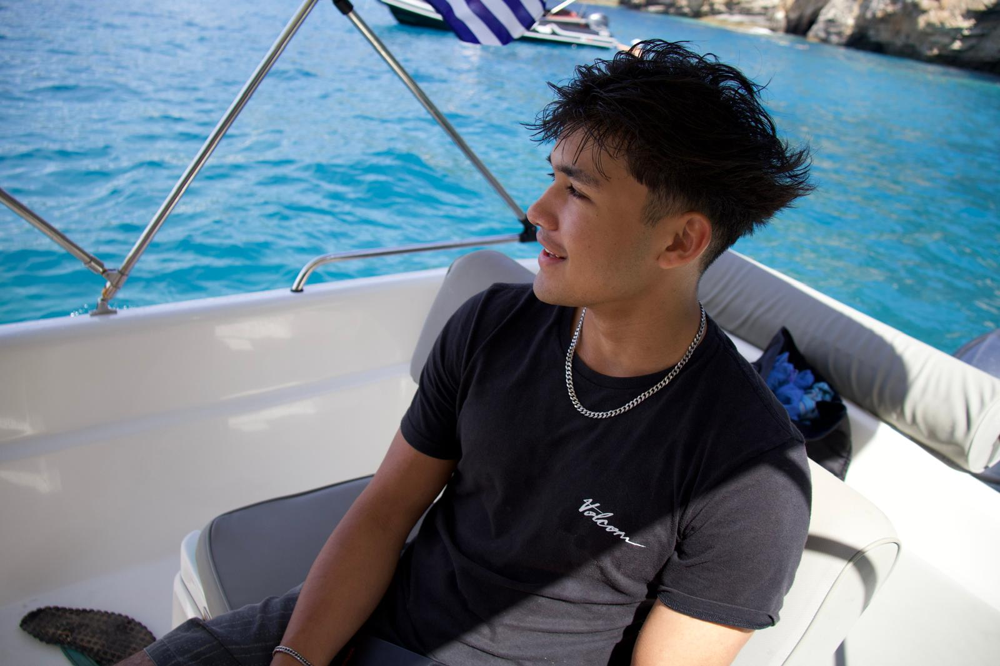
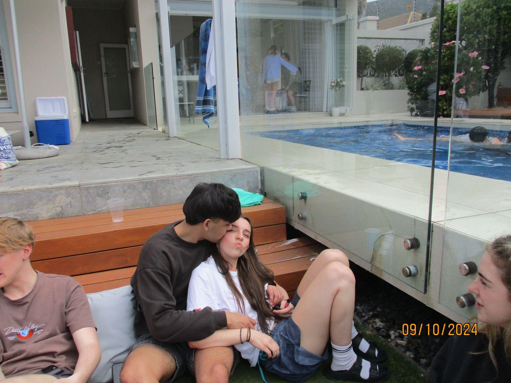

# 🤖 Hi, I'm Jackson Gee 

  
  
  
  
   
  
  
  

#

  
<b>📘 More About Me</b>

   
  

    

      👋 Hi there! I'm Jackson, a first-year AI major looking to make it to the big leagues of AI. I moved here (Perth) from Cape Town, South Africa 🇿🇦 to pursue my further studies. I plan to deeply understand all there is about AI 🤖 — from data science to machine learning. And when I mean learn... I mean learn — no vibe-coding, just pure knowledge 🧠. My goals are to achieve 🎯 top marks, build 💻 personal projects, and create things that genuinely teach me something new. All of this to hopefully land an awesome 💼 internship somewhere...
       I know some people might say I’m getting ahead of myself — but honestly, that’s the point. To. Get. Ahead. 🦾
 
      Anyways... I’m part of my uni’s 🤝 AI club, I have an unbelievably cute 🐶 dog — Bailey the Beagle — and I love 🏋️ working out. I also have an amazing girlfriend ❤️
 
      If you’ve gotten this far, thanks so much for taking a moment out of your day to read this 🙏
    

  

  <!-- 🐶 Image gallery inside the dropdown -->
  

    
    
    
  

## 🧰 Languages and Tools
### Specialised:

  

<!-- This is a comment that will not be displayed in the rendered output. 

-->
### Generalised:
**Programming Languages:** `Java`, `SQLite`, `C` 

**Development Tools:** `IntelliJ`, `Access`, `Canva`, `Visual Studio Code`, `n8n`, `Capcut`  

#

## 🚀 Projects & Research

  
Data Science

  <ul>
    <li>
      <!-- Add your data science projects here -->
    </li>
  </ul>

  
Machine Learning

  <ul>
    <li>
      <a href="https://github.com/jacksonjgee/SVM-Titanic">SVM-Titanic: Predict Titanic survival with Support Vector Machine</a>  
       Used Python, JupyterLab, Pandas, NumPy, Scikit-learn and Matplotlib to build, train, and evaluate an SVM model for the Titanic dataset (Kaggle).
    </li>
  </ul>

  
Other

  <ul>
    <li>
      <!-- Add your deep learning projects here -->
    </li>
  </ul>

#

## 💼 Experience

**Training Connection** — *Automation Developer*  
June 2025 – Jan 2026
 Developed **n8n workflows** (Zoom API) for automatic meeting creation and an **ElevenLabs-powered AI phone receptionist** integrated with Google Sheets and CRM. Improved scheduling reliability and client communication.

**Dreampage** — *Video Production Assistant*  
June 2023 – Nov 2023  
Produced and edited course modules, handling **camera operation**, **post-production editing**, and **colour correction**, delivering high-quality learning content.

#

## 🎓 Education

**Bachelor of Advanced Computer Science (Honours)** — *`1st Year`*  
Majoring in Artificial Intelligence at the **University of Western Australia** — `WAM 76` `ATAR 93`

Relevant Course Units:
- Computational Thinking With Python
- Relational Database Management Systems
- Cyber Security
- Philosophical AI
- System Programming
- Intro to Data Science

